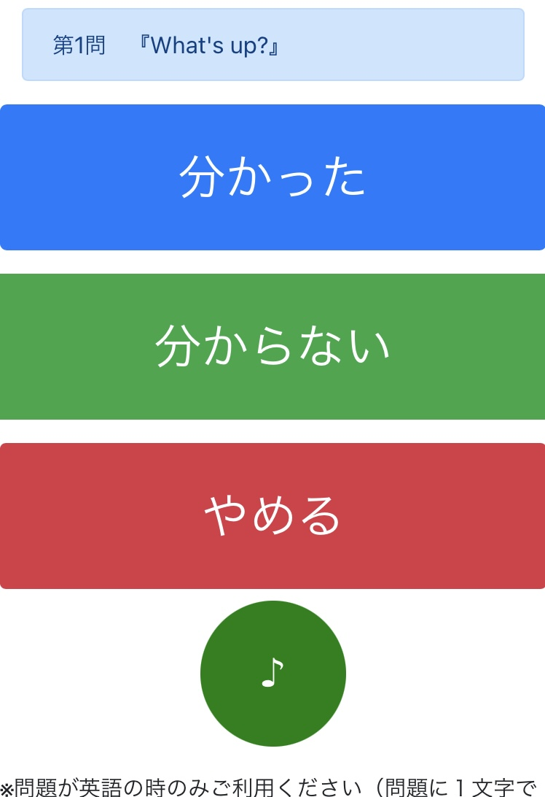
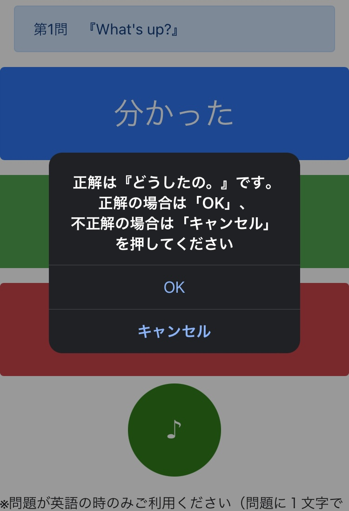
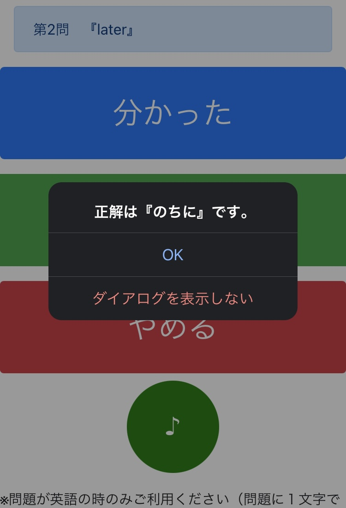
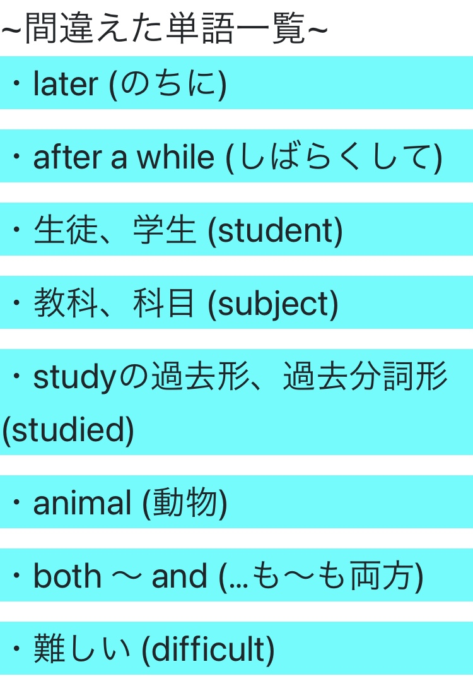

# 「中高生向け英単語学習ツール」

2022年春頃、塾バイトをしているときに製作したウェブアプリケーション「中高生向け英単語学習ツール」です。
ディレクトリに高校英語と書いていますが、そちらに関しては現在ネットには実質非公開状態です。

###### ※当時、Githubの使い方に慣れていなく、かつこれのサイトのURLを当時の塾の生徒に渡してしまったりの状態で、あまりディレクトリ構造が変更できないのが欠点。

# 使用言語

# 概要
#### ○これがアプリのクイズ画面です。
(https://todorokitai.github.io/Main/%E4%B8%AD%E5%AD%A6%E8%8B%B1%E8%AA%9E/section.html?0)

#### ○「分かった」をクリックすると以下の画面が表示されます。

#### ○「分からない」をクリックすると以下の画面が表示されます。

#### ○クイズを一通り終わらせる、または「やめる」をクリックすると以下のリザルト画面が表示されます。
・間違いが存在した場合。

・全問正解した場合。

・１問目を解かずに「やめる」をクリックした場合

# 使い方
##### １. 問題が表示されたらその英単語を頭の中で翻訳してみる（日本語が表示された場合はそれを頭の中で英訳する）。
##### ２. 「１」ができそうなら「分かった」をクリックする。（「４」へ）
##### ３. 「１」ができなさそうなら「分からない」をクリックする。（「５」へ）
##### ４. 答えが表示されるので頭の中で考えていたことと大体同じなら「OK」を押し、違かったら「キャンセル」を押す。
##### ５. 答えが表示される
##### ６. リザルト画面が出る、または「やめる」をクリックするまで「１」〜「５」の手順を繰り返す
